 7542 - Taller-Pages

## Nicolás Riedel

## Padrón : 102130

### Repositorio : https://github.com/RiedelNicolas/7542-Taller-Pages

## Trabajo :

## Desarrollar una aplicación servidor que atienda petitorios HTTP, mediante los cuales puede acceder y dar de alta recursos de los mismo.

## Clases desarrolladas :

## Client

Maneja la lógica del cliente: recibe un petitorio HTTP mediante STDIN; hace la consulta con un servidor;espera la respuesta y luego la muestra por pantalla.

## Lock

Contiene una referencia  a una instancia de  [mutex](http://www.cplusplus.com/reference/mutex/mutex/) , se utiliza como bloqueante para proteger los objetos compartidos.

## Socket

Implementacion de Socket en c++.

## Thread

Implementacion de TDA Thread, fuertemente infulenciado por el del tutorial interactivo de la catedra. Se utiliza como clase abstracta. 

## ClientHandler

Clase encargada de manejar los nuevos clientes que se conectan al servidor. Es una clase derivada de **Thread**, esto nos permite hacer uso de concurrencia y manejar multiples clientes desde un único servidor.

## PetitionProcessor

Encargada de esconder la lógica de los petitorios. Contiene una  **PetitionLogic**, a la cual delega las responsabilidades. 

## PetitionLogic

Clase abstracta, sus derivados implementan la logica de los distintos tipos de petitorios que tiene el trabajo. Estos son : 

- **PetitionGet** :  Busca el recurso deseado.

- **PetitionPost** : Da de alta el recurso especificado.

- **PetitionInvalid** : Es el caso donde se recibe un petitorio invalido, no aplica cambios pero notifica al cliente.

  

## PetitionParser

Encargado de parsear los petitorios recibidos.

## PrintMonitor

Objeto compartido entre distintos threads, usado para imprimir por pantalla. ( **Thread**-**safe**)

## RequestManager

Clase encargada de establecer las conexiones entrantes. Es la que genera instancias de **ClientHandler** cada vez que se conecta un cliente nuevo. Es una clase derivada de  **Thread**.

## **ResourcesRepository**

Objeto compartido, utilizado para almacenar los distintos recursos que se reciben.  ( **Thread**-**safe**)

## **Server**

Engloba la lógica del servidor, resuelve petitorios hasta que recibe una 'Q' por STDIN.

## Exceptions

### InvalidFileException

Utilizada cuando no se encuentra el archivo pedido. (En el caso de este TP el Root).

### Osexception

Utilizada cuando hay un error en un syscall.  Su **.what()** muestra el strerror correspondiente al errno asociado al error. 

### SocketException

Ocurrió un error en la utilización de los sockets.

## Diagramas :

Diagrama de clases General : 

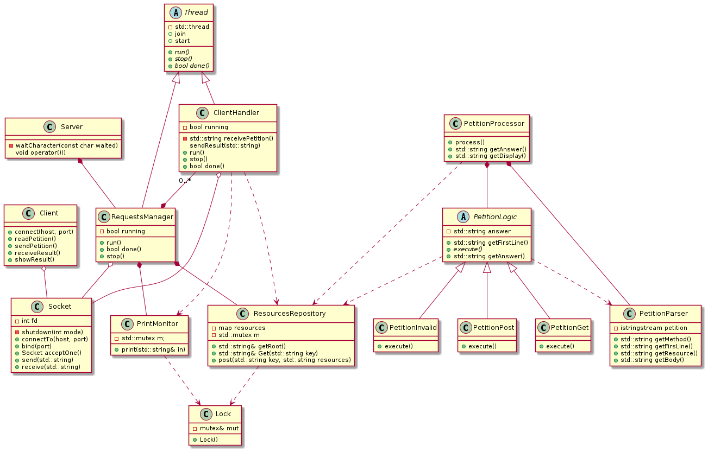

Diagrama de Secuencia, punto de vista cliente : 

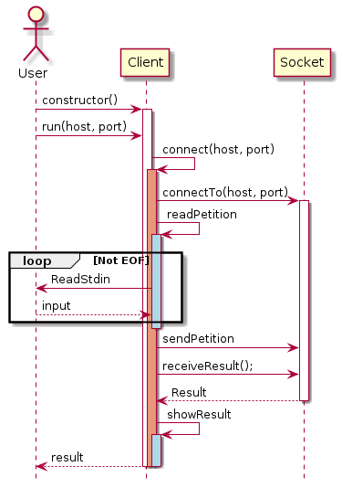

Diagrama de Secuencia, punto de vista Servidor, caso general : 

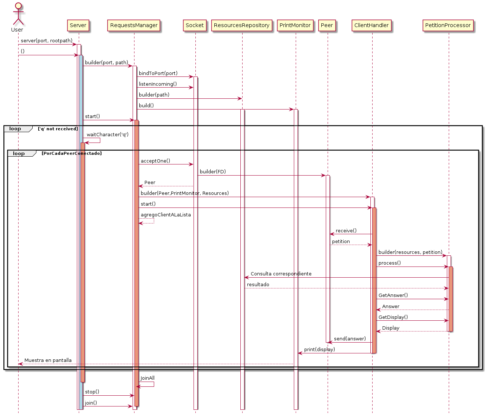

## Solución a los issues :

1.

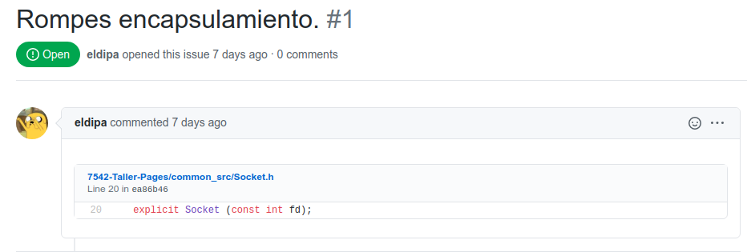

​		Ahora dicho constructor es privado.

2. 

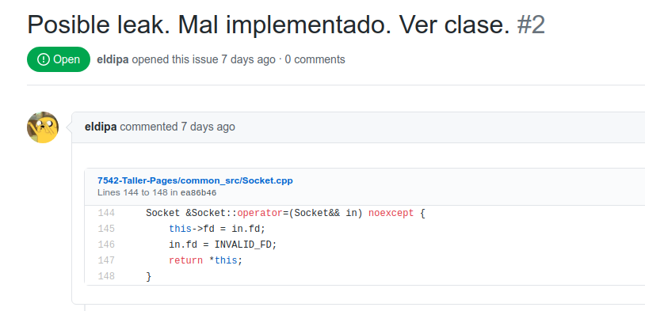

​	                             Luego de ver el ejemplo de la clase, entendí el error y lo cambie por :  

​                             	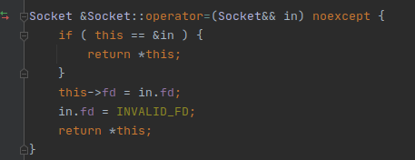

3. 

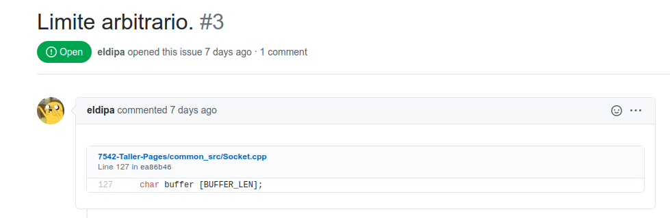

​				Según se nos especifico en la clase teníamos permitido usar cualquier chunk size (siempre  y cuando este sea mayor a uno), 1024 bytes me pareció un tamaño  apropiado.

4.

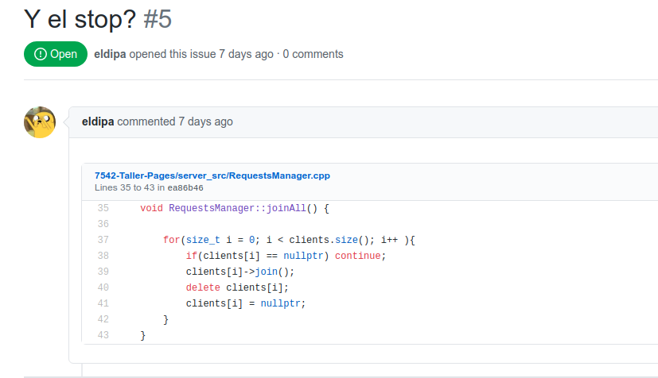

​								Se cambio la implementación del Thread-Reaper, ademas se fuerza el stop de los threads cuando se cierra el socket aceptador. 

5.

​	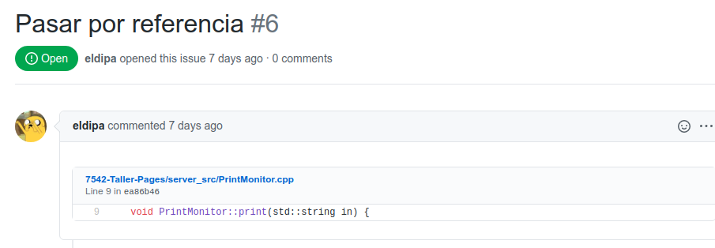

 				Comprendo lo que esta mal en este tipo de casos, se corrigen.

6.

​							 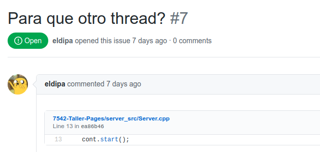

​							Se pasa funcionalidad al hilo principal.

7.

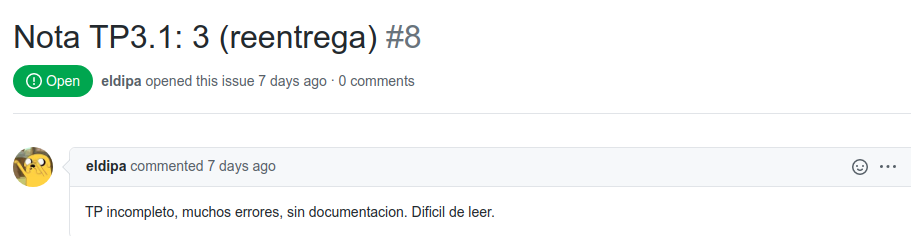

​					Se completa la implementación pedida por el enunciado, se documenta el código y se realiza un informe.